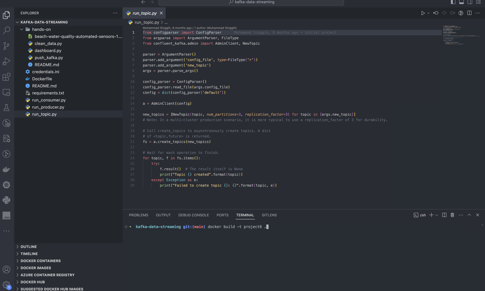
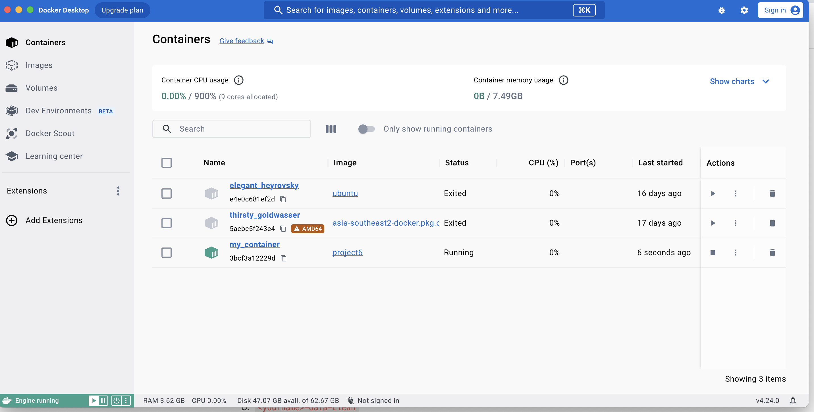

# project-6-kafka-spark

ETL process used python as main programming language, Kafka and Spark

1. Membuat Image Docker untuk project realtime streaming

_Picture 1: build image_

2. Sign up pada Confluent, untuk menggunakan cloud kafka

_Picture 2: Confluent Kafka_

3. Docker Image berhasil di buat

_Picture 3: success Create Image Docker_

4. Container berhasil di run  

_Picture 4: success Run Container_

5. Check isi dari container

_Picture 5: check container_

6. Generate Credential buat Confluent Kafka

_Picture 6: Credential Kafka_

7. Pindahkan Credential di local ke container

_Picture 7: Copy Credential_

8. Test buat 1 topic di cloud kafka  

_Picture 8: test topic_

9. Check Topic Test yang baru saja di buat di confluent

_Picture 9: check test topic_

10. Buat 2 topic lain (raw and clean)

_Picture 10: topics_

11. Check topic yang baru saja dibuat

_Picture 11: check topic_

12. Testing Producer dan Consumer Confluent-Kafka  

_Picture 12: Producer & Consumer_

13. Push Data CSV (raw data) to topic reza-data-raw

_Picture 13: push raw data to topic reza-data-raw_

14. Check raw daat yang di kirim ke topic reza-data-raw

_Picture 14: check raw data_

15. Consume reza-raw-data

_Picture 15: cleaning data from topic raw-data_

16. Proses Transform data dan dikirim ke topic reza-clean-data

_Picture 16: transform to clean data_

17. Running Dashboard untuk melihat/consume dari topic reza-clean-data

_Picture 17: running dashboard become consumer_

18. Check dashboard

_Picture 18: dashboard_

19. Realtime Streaming kafka and spark 

_Picture 19: realtime dashboard_

